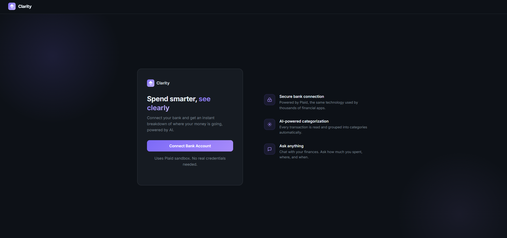

# Clarity

An intelligent financial dashboard that connects your real-world banking data with advanced AI. By linking securely through the Plaid API, it automatically organizes every transaction into logical categories and provides natural language insights about your spending patterns.


Live at [Clarity](https://clarity-finance-tracker.vercel.app/)

---
## Screenshots




## What it does

Most finance apps show you a list of transactions and leave the thinking to you. Clarity connects to your bank through Plaid, runs every transaction through an LLM for categorization, and lets you ask questions about your spending in plain English.

**Key features:**

- **Bank connection** - links your account via Plaid Link, no manual entry
- **AI categorization** - every transaction is automatically sorted into food, transport, shopping, income, and more by LLaMA 3.3 70B
- **Spending chart** - bar chart breakdown by category, excluding income
- **Sortable transactions** - click any column header to sort by name, date, category, or amount
- **Stat cards** - total spent, total income, and top spending category at a glance
- **AI chat** - ask anything about your money and get answers grounded in your actual data
- **Session persistence** - stays logged in across page refreshes

---

## Tech stack

| Layer | Tech |
|---|---|
| Frontend | React 18, Vite, Recharts |
| Backend | FastAPI, Uvicorn, Python |
| Bank data | Plaid API (sandbox) |
| AI | Groq API, LLaMA 3.3 70B |

---

## Getting started

You'll need a [Plaid](https://plaid.com) account (sandbox is free) and a [Groq](https://console.groq.com) API key (also free).

### Backend

```bash
cd backend
pip install -r requirements.txt
cp .env.example .env   # fill in your keys
python main.py
```

### Frontend

```bash
cd frontend
npm install
npm run dev
```

Open `http://localhost:5173` and connect using Plaid sandbox credentials.

---

## Environment variables

```env
PLAID_CLIENT_ID=your_client_id
PLAID_SECRET=your_sandbox_secret
PLAID_ENV=sandbox
GROQ_API_KEY=your_groq_key
FRONTEND_URL=http://localhost:5173   # set to your deployed frontend URL in production
```

---

## API endpoints

| Method | Path | Description |
|---|---|---|
| `POST` | `/plaid/link-token` | Create a Plaid Link token to initiate bank connection |
| `POST` | `/plaid/exchange-token` | Exchange public token for access token after Plaid Link |
| `GET` | `/plaid/transactions` | Fetch raw transactions from Plaid |
| `POST` | `/plaid/disconnect` | Clear the stored access token and session |
| `GET` | `/insights` | Categorize transactions with AI and generate spending insights |
| `POST` | `/insights/chat` | Ask a question about your spending |

---

## How the AI works

The `/insights` endpoint:

1. Fetches your last 30 days of transactions from Plaid
2. Sends them to LLaMA 3.3 70B with a categorization prompt
3. Each transaction gets assigned a category (food, transport, income, etc.)
4. A second LLM call generates 3-4 spending insights based on the category breakdown
5. Both the categorized transactions and insights are returned together and cached

The chat endpoint reuses the cached transactions so every follow-up question is fast. The AI has access to your full transaction history including dates, merchants, and amounts.

---

## Deployment

Backend on Oracle Cloud (Ubuntu VM, systemd service), frontend on [Vercel](https://vercel.com). Deployments are automated via GitHub Actions - pushing to `main` triggers an SSH deploy that pulls the latest code and restarts the backend service.

The frontend proxies all `/api/*` requests through Vercel to avoid mixed-content issues. Set `FRONTEND_URL` in the backend `.env` to your Vercel app URL so CORS works.
